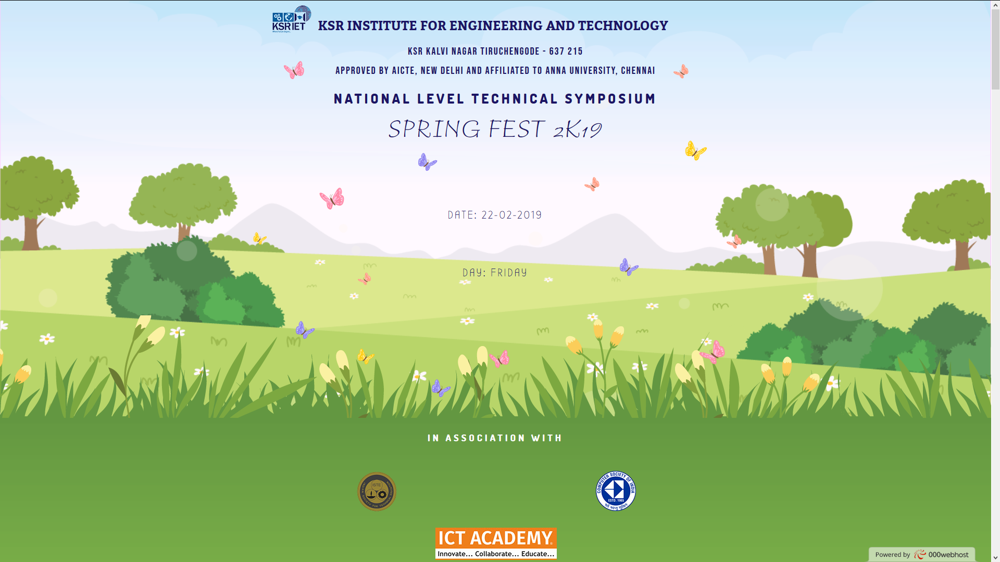

# About Springfest
* This project is a simple landing page for my institution's Technical Symposium.
* It explains various departments and their events.
* This project was completed by using Adobe Muse.

## About Adobe Muse
* Adobe Muse is a website builder that allows designers to create fixed, fluid, and adaptive websites without having to write any code. 
* Muse generates static websites giving users the freedom to host their sites with any hosting provider.

## Screenshot

